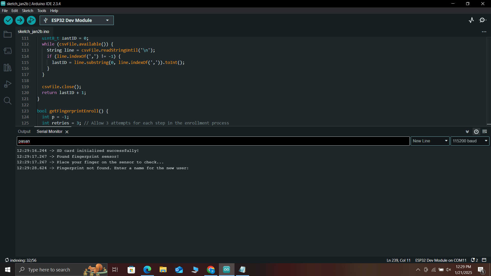
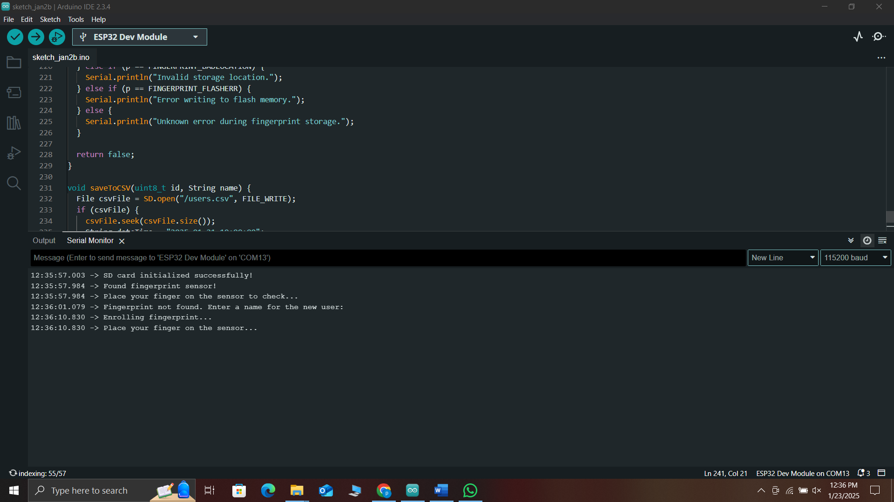
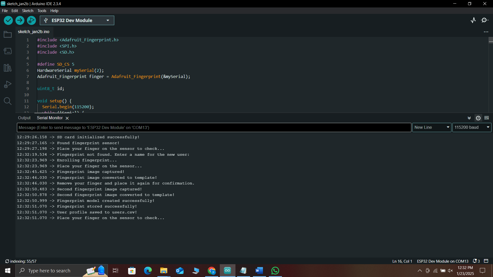
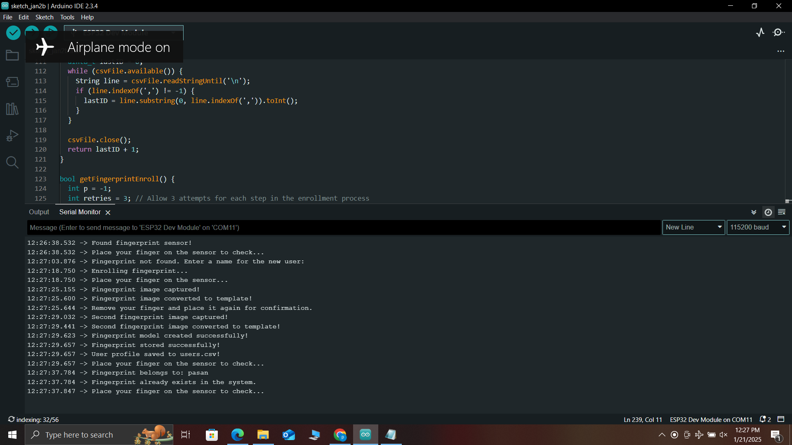
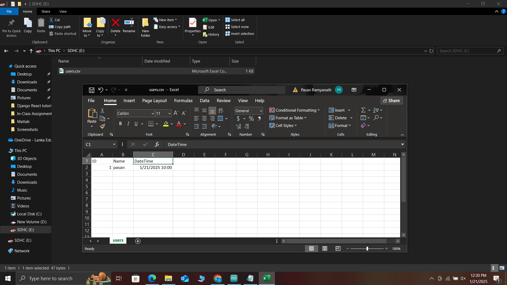

# ESP32 Fingerprint Scanner with SD Logging

An ESP32-based fingerprint identification and enrollment system using an Adafruit‑compatible optical fingerprint sensor (e.g., DY50/R307/ZFM-20) with on-device storage of user metadata to a microSD card. The sketch enrolls new users when an unknown fingerprint is detected, stores the template on the sensor, and appends `ID,Name,DateTime` rows to `/users.csv` on the SD card.

This repository contains a single Arduino sketch that runs on an ESP32 DevKit board and communicates with the fingerprint module over UART2 and with the SD card over SPI.

---

## Features

- Enrollment flow with two scans and model creation
- Identification against templates stored in the sensor’s flash
- CSV logging on microSD: `ID,Name,DateTime`
- Simple Serial Monitor prompts for adding new users by name
- Uses hardware serial (UART2) on GPIO 16/17 for reliable sensor I/O

---

## Repository Structure

```
.
├── LICENSE                      # Apache-2.0
├── README.md                    # This file
└── Fingerprint_scanner_project/
		└── Fingerprint_scanner_project.ino
```

---

## Bill of Materials

- ESP32 DevKit (e.g., ESP32-WROOM-32)
- Optical fingerprint sensor compatible with Adafruit Fingerprint Sensor Library
	- Examples: DY50, R307, ZFM‑20/60
- microSD card module (SPI) and a FAT32‑formatted microSD card
- Jumper wires and a breadboard (or equivalent wiring)
- 5V power for the sensor if required by your module (see your sensor’s datasheet)

---

## Wiring

Fingerprint sensor (UART, 3.3V logic; most optical sensors accept 5V power):

| Fingerprint Sensor | ESP32 |
| --- | --- |
| TX | GPIO16 (RX2) |
| RX | GPIO17 (TX2) |
| VCC | 5V or 3.3V (per sensor spec) |
| GND | GND |

microSD module (SPI):

| microSD Module | ESP32 |
| --- | --- |
| CS | GPIO5 |
| SCK | GPIO18 |
| MISO | GPIO19 |
| MOSI | GPIO23 |
| VCC | 3.3V (many modules also accept 5V—check yours) |
| GND | GND |

Notes:
- Ensure common ground between all modules and the ESP32.
- Some fingerprint sensors require 5V for illumination while still using 3.3V UART logic. Check your module’s documentation.
- If your ESP32 board already exposes an SD slot, adjust `SD_CS` accordingly or use the built‑in SD interface if applicable.

---

## Software Setup

1. Install Arduino IDE 2.x.
2. Install the ESP32 board package via Boards Manager (Espressif Systems).
3. Libraries (via Library Manager):
	 - Adafruit Fingerprint Sensor Library (by Adafruit)
	 - `SD` and `SPI` come with the ESP32 Arduino core.
4. Open `Fingerprint_scanner_project/Fingerprint_scanner_project.ino`.
5. Select Board: “ESP32 Dev Module” (or your specific ESP32 board) and the correct COM port.

---

## Configuration

In `Fingerprint_scanner_project.ino`:

- SD card chip select: `#define SD_CS 5`
	- Change if your SD module uses a different CS pin.
- Fingerprint UART pins: `mySerial.begin(57600, SERIAL_8N1, 16, 17);`
	- Adjust GPIOs if you soldered to different pins. Keep baud at `57600` unless your sensor is configured differently.

---

## How It Works

1. Boot:
	 - Initializes SD at `CS=5`. Ensures `/users.csv` exists and creates a header row if missing.
	 - Initializes the fingerprint sensor over UART2 and verifies the sensor password.
2. Loop:
	 - Prompts to place a finger. When a finger image is captured, it searches for a match among templates in the sensor.
	 - If a match is found, it prints the associated name from `/users.csv`.
	 - If no match is found, it prompts via Serial Monitor for a new user name, performs a two‑step enrollment, stores the template in the sensor under the next numeric ID, and appends an entry to `/users.csv`.

CSV file: `/users.csv`

```
ID,Name,DateTime
1,Alice,2025-01-20 10:00:00
2,Bob,2025-01-20 10:00:00
```

Important: The `DateTime` column is currently a placeholder in code. See “Real Time Stamps” below to store actual timestamps.

---

## Upload & Run

1. Connect the ESP32 over USB and select the correct port.
2. Click Upload in Arduino IDE.
3. Open Serial Monitor at `115200` baud with line ending set to “Newline”.
4. Follow on‑screen prompts:
	 - Place a finger to check for an existing match.
	 - If unknown, you will be asked to type a user name and press Enter.
	 - Perform two scans for enrollment when prompted.

---

## Screenshots

The following screenshots show the device and Serial Monitor interaction during setup, enrollment, and identification. Images are listed in sequence (1 → 7).

- Screenshot 1: 


- Screenshot 2:



- Screenshot 3:



- Screenshot 4: 


- Screenshot 5: 



- Screenshot 6:



- Screenshot 7:




## Troubleshooting

- SD card initialization failed!
	- Check wiring (CS=GPIO5 by default), ensure FAT32 format, try a different card.
- Did not find fingerprint sensor :(
	- Swap RX/TX lines (sensor TX → ESP32 RX2/GPIO16, sensor RX → ESP32 TX2/GPIO17), confirm power level, and keep common ground.
- Fingerprint image errors (messy/failed):
	- Clean the sensor surface, keep the finger still, try multiple times.
- Name prompt not working / empty input:
	- Set Serial Monitor line ending to “Newline”, type a name, press Enter.
- Nothing matches even for enrolled users:
	- Ensure enrollment completed successfully and ID stored. If necessary, re‑enroll.

---

## Known Limitations & Notes

- Real Time Stamps: The code currently writes a fixed timestamp string when saving to CSV. To log real time, integrate NTP (`configTime`) or an RTC and replace the placeholder with the current date/time.
- Search Flow Detail: The identification path should include converting the captured image to a template buffer before calling a search (typical sequence: `getImage() → image2Tz(1) → fingerSearch()` or `fingerFastSearch()`). The provided sketch calls `finger.fingerSearch()` after capturing the image; if you see unreliable matching, consider inserting `finger.image2Tz(1)` before calling `fingerSearch()`.
- Sensor Password: The sketch uses the sensor’s default password via `verifyPassword()`. If you changed the sensor password, adapt the initialization accordingly.

---

## Extending the Project

- Add NTP time sync and store real timestamps.
- Implement admin commands over Serial to list users, delete IDs, or clear the database (`emptyDatabase`).
- Add OLED/LCD feedback and a buzzer/LED for UX.
- Protect the CSV with checksums or migrate metadata to SPIFFS/LittleFS.

---

## Acknowledgements

- [Adafruit Fingerprint Sensor Library](https://github.com/adafruit/Adafruit-Fingerprint-Sensor-Library)
- ESP32 Arduino core by Espressif Systems

---

## License

Licensed under the Apache License, Version 2.0. See [`LICENSE`](./LICENSE).

